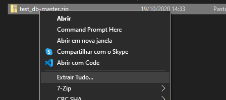
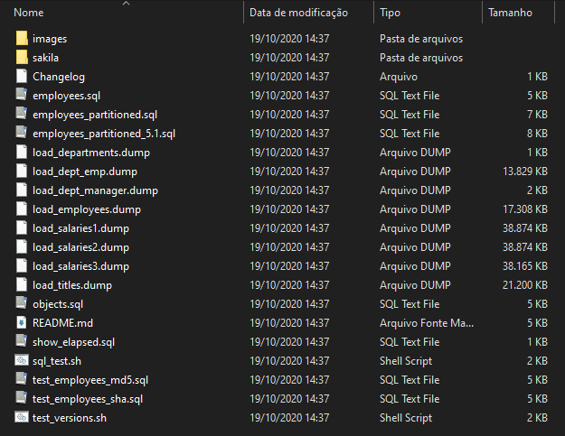
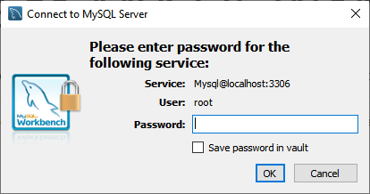
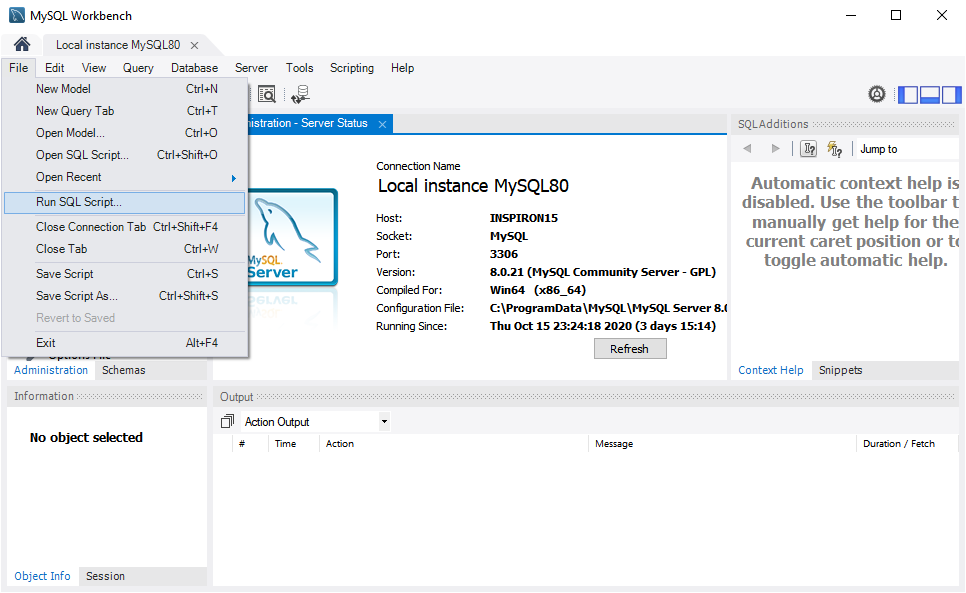
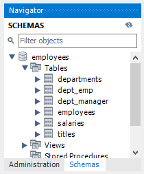
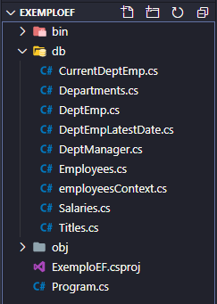

# ORM com Entity Framework e MySQL

[📽 Veja esta vídeo-aula no Youtube](#) _Em breve..._

No objetivo é acessar bancos de dados no C#. Há uma infinidade de maneiras de se fazer isso; nesse curso optaremos pela seguinte combinação:

- Modelo de armazenamento de dados: [Modelo relacional](https://pt.wikipedia.org/wiki/Modelo_relacional)
- Sistema de banco de dados: [MySQL](https://dev.mysql.com/), com a IDE padrão MySQL Workbench
- Técnica de desenvolvimento: [ORM (_Object-Relational Mapping_)](https://pt.wikipedia.org/wiki/Mapeamento_objeto-relacional)
- _Framework_ de ORM para C#: [Microsoft Entity Framework Core](https://docs.microsoft.com/pt-br/ef/core/)

Está fora do escopo desse curso ensinar bancos de dados. Há diversos cursos na Internet sobre o assunto. Infelizmente isso é um pré-requisito necessário.

💡 _Se você é um aluno de curso presencial de Etec, você certamente cursou ou está cursando componentes que tratam de bancos de dados relacionais._

## Preparando um banco de dados

Precisamos de uma instância de MySQL em execução com um banco de dados para ser acessado, e credenciais válidas com permissões suficientes.

Nos exemplos abaixo consideraremos uma instalação padrão do MySQL, com as seguintes configurações:

- Servidor local (`localhost`) na porta `3306`;
- Credenciais `root`, senha `root`.

Vamos usar um banco de dados de exemplo contante na documentação do MySQL chamado `employees`. Você pode usar um outro banco de dados qualquer, se preferir.

Baixe o `Employees` no site do MySQL, _Documentation_, [_More_](https://dev.mysql.com/doc/index-other.html). Em _Example Databases_, você verá um link para o [repositório no GitHub](https://github.com/datacharmer/test_db), e um para a [_documentação_](https://dev.mysql.com/doc/employee/en/). Na documentação há várias informações úteis, como por exemplo, o [seu diagrama entidade-relacionamento](https://dev.mysql.com/doc/employee/en/sakila-structure.html).


DER:


No GitHub, baixe o repositório e extraia o conteúdo para uma pasta temporária (pode clonar, se preferir).





Você deverá possui os seguintes arquivos:



Abra o Workbench, e conecte-se ao seu banco de dados:




Execute o script `employees.sql` usando a opção _File_, _Run SQL Script..._.




Confirme a execução e aguarde.


Ao final, na janela _Navigator_, aba _Scchemas_, atualize clicando no botão no canto superior direito. Seu banco de dados deve aparecer na lista. Abra a lista de tabelas e verifique se elas estão lá.



Feito isso, seu servidor possui um banco de dados carregado e _online_. Você pode apagar os arquivos baixados do GitHub, se quiser.

## Conectando um projeto C# `console` com o MySQL

Crie seu projeto console, normalmente.

Agora, vamos adicionar em seu projeto, via NuGet, os pacotes do Entity Framework (EF).

```
dotnet add package Microsoft.EntityFrameworkCore
dotnet add package Microsoft.EntityFrameworkCore.Design
```

Também precisamos do pacote de suporte ao MySQL:

```
dotnet add package MySql.Data.EntityFrameworkCore
```

Como vamos usar ORM, precisaremos de classes em nosso programa equivalentes às tabelas no banco de dados. Podemos criá-las automaticamente, com ferramentas. Esse processo de criar código usando ferramentas é chamado _scaffolding_.

Primeiro, vamos instalar a ferramenta _Entity Framework Core .NET Command-line Tools_, que nos traz diversas facilidades para trabalhar com EF. Você so fará isso uma vez em seu computador, não precisando repetir todas as vezes.

```
dotnet tool install --global dotnet-ef
```

Para testar se ela já está instalado, digite `dotnet ef --version`.

Instalada:

```
C:\Users\ermog\Documents\code>dotnet ef --version
Entity Framework Core .NET Command-line Tools
3.1.9
```

Não-instalada:

```
C:\Users\ermog\Documents\code>dotnet ef --version
Não foi possível executar porque o comando ou o arquivo especificado não foi encontrado.
Possíveis motivos para isso incluem:
 * Você digitou incorretamente um comando de dotnet embutido.
 * Você pretendia executar um programa .NET Core, mas dotnet-ef não existe.
 * Você pretendia executar uma ferramenta global, mas não foi possível encontrar um executável com prefixo de dotnet com esse nome no CAMINHO.
```

Agora podemos realizar o _scaffolding_, passando a string de conexão para o seu banco:

```
dotnet ef dbcontext scaffold "server=___;port=___;user=___;password=___;database=___" MySql.Data.EntityFrameworkCore -o ___ -f
```

- Em `server` passe o endereço do servidor (ex.: `localhost`)
- Em `port` passe a porta do servidor (ex.: `3306`)
- Em `user` e `password` passe o seu usuário e senha;
- Em `database` passe o nome do banco  (ex.: `employees`)
- Em `-o` indique a pasta onde as classes serão criadas

Exemplo:

```
dotnet ef dbcontext scaffold "server=localhost;port=3306;user=root;password=root;database=employees" MySql.Data.EntityFrameworkCore -o db -f
```

Saída:

```
Build started...
Build succeeded.
```

Seu projeto ficará parecido com isso:



## Entendendo o _scaffolding_

Foi criada uma classe com o contexto (`employeesContext.cs), que fará o acesso ao banco.

Ela contém a string de conexão, em texto aberto, no método `OnConfiguring`. Há um _warning_ incluso, já que não é boa prática ter usuário e senha fixos dentro da aplicação. Por enquanto, certifique-se que a senha utilizada não é sensível (já que ela poderá subir ao GitHub, por exemplo), e remova a linha iniciada com `#warning`. Futuramente faremos uma segurança mais apurada.

Também foram criadas propriedades do tipo _DbSet_ para cada uma das suas tabelas, fazendo referência às classes com a estrutura da tabela, que estão nos demais arquivos criados.

No método `OnModelCreating` está definida toda a estrutura da tabela, baseada nos scripts DML (como `CREATE TABLE`, por exemplo).

As classes com as estruturas das tabelas (como `Departments.cs`) permitem verificar os tipos de dados e os relacionamentos de cada tabelas.

Agora, podemos usar os DbSets e as classes das tabelas para manipular nosso banco de dados.

## Usando o `DbContext`

Todo comando que acesse banco deve usar o contexto criado. Para isso, envolvemos o comando no bloco `using`, que garante que a conexão será aberta, e fechada quando não for mais necessária.

```cs
using (var db = new employeesContext())
{
    // o objeto db agora dá acesso ao contexto employeesContext
}
```

Perceba que podemos renomear `db` como quisermos (é comum usar `context`, por exemplo). O nome da classe de contexto deve ser o nome da classe criada pelo _scaffolding_.

Para usar o contexto, temos que adicionar referência a ele.

```cs
using nomeDoProjeto.nomeDaPastaUsadaNoScaffolding;
```

## Iterando todos os registros de uma tabela

Podemos, por exemplo, exibir todos os registros de uma tabela, iterando com `foreach`.

```cs
// ...
using ExemploEF.db;
// ...
using (var db = new employeesContext())
{
    // Para cada registro na tabela Departments
    foreach (var dep in db.Departments)
    {
        Console.WriteLine($"O departamento {dep.DeptNo} se chama {dep.DeptName}.");
    }
}
// ...
```

Dados cadastrados:


Saída:

```
C:\Users\ermog\Documents\code\DevWeb\ExemploEF>dotnet run
O departamento d009 se chama Customer Service.
O departamento d005 se chama Development.
O departamento d002 se chama Finance.
O departamento d003 se chama Human Resources.
O departamento d001 se chama Marketing.
O departamento d004 se chama Production.
O departamento d006 se chama Quality Management.
O departamento d008 se chama Research.
O departamento d007 se chama Sales.
```

## Usando Linq

Ao fazer referência à `System.Linq`, podemos usar seus métodos pra manipular os resultados. Serão criados os scripts `DQL` adequados (`SELECT`, `WHERE`, `ORDER BY`, etc.).

Você pode utilizar `OrderBy` para ordenar os registros:

```cs
foreach (var dep in db.Departments.OrderBy(d => d.DeptNo))
{
    Console.WriteLine($"O departamento {dep.DeptNo} se chama {dep.DeptName}.");
}
```

Saída:

```
C:\Users\ermog\Documents\code\DevWeb\ExemploEF>dotnet run 
O departamento d001 se chama Marketing.
O departamento d002 se chama Finance.
O departamento d003 se chama Human Resources.
O departamento d004 se chama Production.
O departamento d005 se chama Development.
O departamento d006 se chama Quality Management.
O departamento d007 se chama Sales.
O departamento d008 se chama Research.
O departamento d009 se chama Customer Service.
```

Também  pode usar `Where` para filtrar.

```cs
foreach (var dep in db.Departments.Where(d => d.DeptName.Contains("ment")))
{
    Console.WriteLine($"O departamento {dep.DeptNo} se chama {dep.DeptName}.");
}
```

Saída:

```
C:\Users\ermog\Documents\code\DevWeb\ExemploEF>dotnet run 
O departamento d005 se chama Development.
O departamento d006 se chama Quality Management.
```

Para obter um só registro, em uma busca por chave, por exemplo, use `SingleOrDefault`. Caso não encontrado, o resultado será `null`.

```cs
var dep = db.Departments.SingleOrDefault(d => d.DeptNo == "d005");
if (dep != null)
{
    Console.WriteLine($"O departamento {dep.DeptNo} se chama {dep.DeptName}.");
}
else
{
    Console.WriteLine("Departamento não encontrado.");
}
```

## Inserindo linhas

Crie uma instância da classe da tabela desejada, e adicione no DbSet. Quando todas as alterações desejadas estiverem feitas, use o método `SaveChanges` do contexto.

```cs
var novoDepto = new Departments
{
    DeptNo = "n001",
    DeptName = "Almoxarifado",
};
db.Departments.Add(novoDepto);
db.SaveChanges();
```

## Alterando uma linha

Altere os valores da linha normalmente, e chame `SaveChanges`.

```cs
var dep = db.Departments.SingleOrDefault(d => d.DeptNo == "n001");
if (dep != null)
{
    dep.DeptName = "Novo nome do Almoxarifado";
    db.SaveChanges();
}
```

## Excluindo uma linha

Use `Remove` e chame `SaveChanges`.

```cs
var dep = db.Departments.SingleOrDefault(d => d.DeptNo == "n001");
if (dep != null)
{
    db.Departments.Remove(dep);
    db.SaveChanges();
}
```
